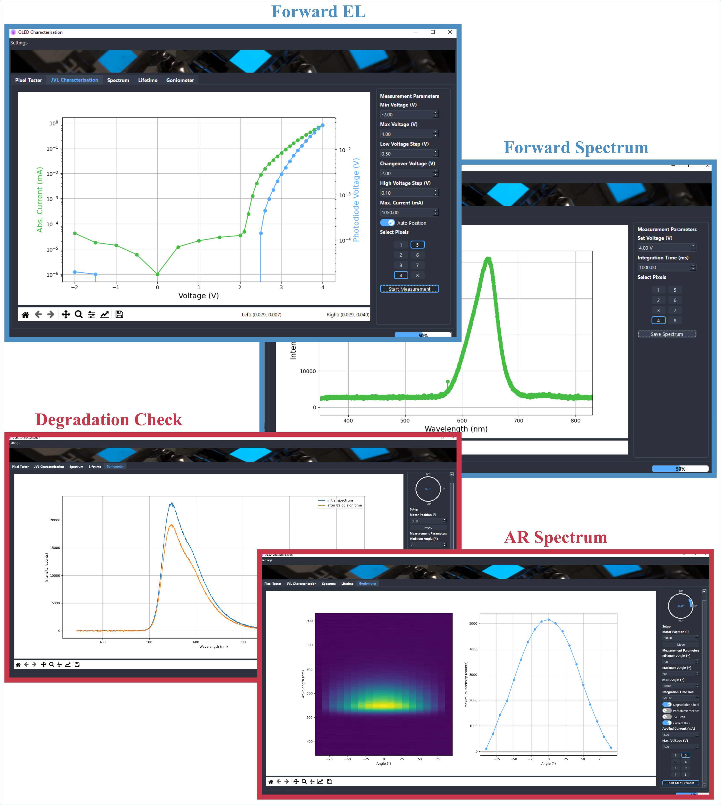

<h1 align="center">
  GatherLab OLED Measurement Setup
</h1>

<p align="center">
   <a href="https://github.com/GatherLab/OLED-jvl-measurement/commits/" title="Last Commit"></a>
   <a href="https://github.com/GatherLab/OLED-jvl-measurement/issues" title="Open Issues"></a>
   <a href="./LICENSE" title="License"></a>
</p>

<p align="center">
  <a href="#setup">Setup</a> •
  <a href="#hardware">Hardware</a>•
  <a href="#user\ journey">User Journey</a>
</p>

The goal of this project is to develop an easy-to-use interface for the
investigation of organic LEDs (OLEDs). The measurements may or may not comprise
current-voltage-luminance or spectral measurements. Additionally, an angle
resolved spectrum of the OLED under investigation is made possible. Ultimately,
the program should be easily usable and facilitate measurement and evaluation of
classic OLED characterization.

The initial work was published in:
Archer, Emily, et al. "Accurate Efficiency Measurements of Organic Light‐Emitting Diodes via Angle‐Resolved Spectroscopy." Advanced Optical Materials 9.1 (2021): 2000838.

And new upgrades (including this software package) in:
<DOI>

## Setup

### Hardware

The different OLED pixels are activated with and Arduino UNO and a relay shield.
Power is provided by a Keithley source unit that also allows the simultaneous
measurement of applied voltage and drawn current. Photodiode voltage is measured
with a Keithley Multimeter. Spectra are measured with an Ocean Spectrometer. For
the goniometer setup, the rotation of the sample is done with a Thorlabs motor.
All items needed for the setup are listed below.

| Item                | Brand         | Model Number                                       |
| ------------------- | ------------- | -------------------------------------------------- |
| Ocean Spectrometer  | Ocean Insight | QE Pro                                             |
| Arduino UNO         | Arduino       | Arduino UNO                                        |
| Keithley Source     | Keithley      | Sourcemeter, Keithley 2450                         |
| Keithley Multimeter | Keithley      | Multimeter, Keithley 2100                          |
| Photodiode          | Thorlabs      | Photodiode, ThorLabs Part PDA100A2                 |
| Thorlab Motor       | Thorlab       | Motorised Rotational Stage, ThorLabs Part K10CR1/M |

### First Setup

Set up a python environment with your favourite virtual environment management
tool. The following step-by-step guide assumes that the user wants to use the,
since python 3.3 recommended software venv, that ships with python on Windows
machines.

1. Clone project folder to your local machine
2. Change e.g. with windows power shell into the project folder
3. Generate a virtual environement with the name "venv"

```terminal
py -m venv venv
```

4. Activate the new environement

```
Set-ExecutionPolicy Unrestricted -Scope Process
.\venv\Scripts\activate
```

5. Install required packages from requirements.txt (this assumes that pip is activated on your machine)

```
pip install -r requirements.txt
```

6. Install visual c++ build tools that are required for the python seabreeze environment: https://visualstudio.microsoft.com/visual-cpp-build-tools/
7. Install thorlabs_apt to obtain apt.dll driver (Follow https://github.com/qpit/thorlabs_apt for correct installation guidelines). For us, it only worked when apt.dll was copied to the Windows/System32 folder.
8. Ensure that libusb-1.0.lib driver is installed for detecting usb hardware (Follow https://stackoverflow.com/questions/33972145/pyusb-on-windows-8-1-no-backend-available-how-to-install-libusb for more on this)
9. Install NI-visa from website: https://www.ni.com/de-de/support/downloads/drivers/download.ni-visa.html#346210
10. Install Keithley drivers from website: https://de.tek.com/source-measure-units/2450-software-6 (prerequisit: NI-visa)
11. On the Keithley source meter (for specs see below) the command set on the Keithley has to be changed to SCPI
12. Execute the main.py file to start the program

```terminal
python3 main.py
```

## Graphic User Interface

Some examples of the graphic user interface provided by the software are shown
below. Notably, all data is directly visualized. Forward emission EL, spectral
readout, lifetime, as well as angle-resolved spectral data can be recorded.



## Development

We encourage bug reports as well as pull-requests from the community to further
enhance this project.

### Formatter

- Python formatter: black

### Data Format

There are three automatically generated types of files depending on the measurement taken out by the user, they differ in their filename ending:

- JVL Characterisation: "2021-04-06_test_d12_p1_jvl.csv"
- Spectrometer: "2021-04-06_test_d12_p1_spec.csv"
- Goniometer: "2021-04-06_test_d12_p6_gon-spec.csv" & "2021-04-06_test_d12_p6_gon-jvl.csv"

this is relevant for later data evaluation and therefore shouldn't be changed.
