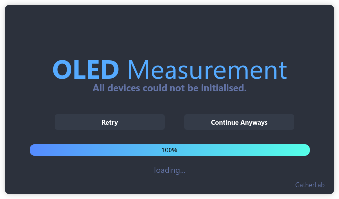
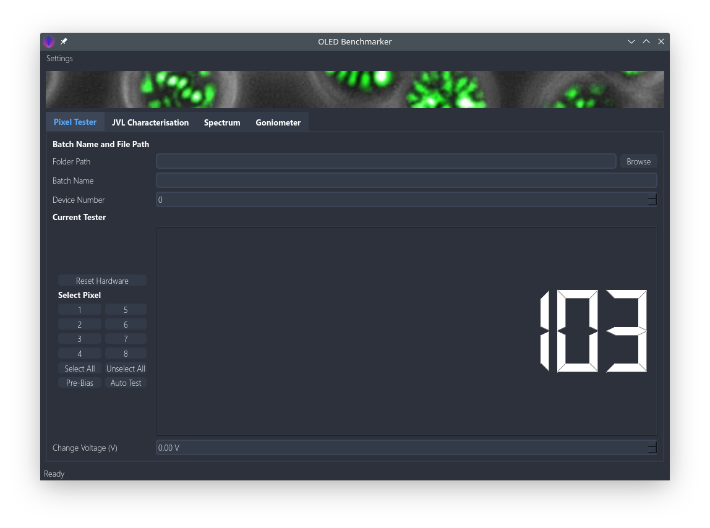
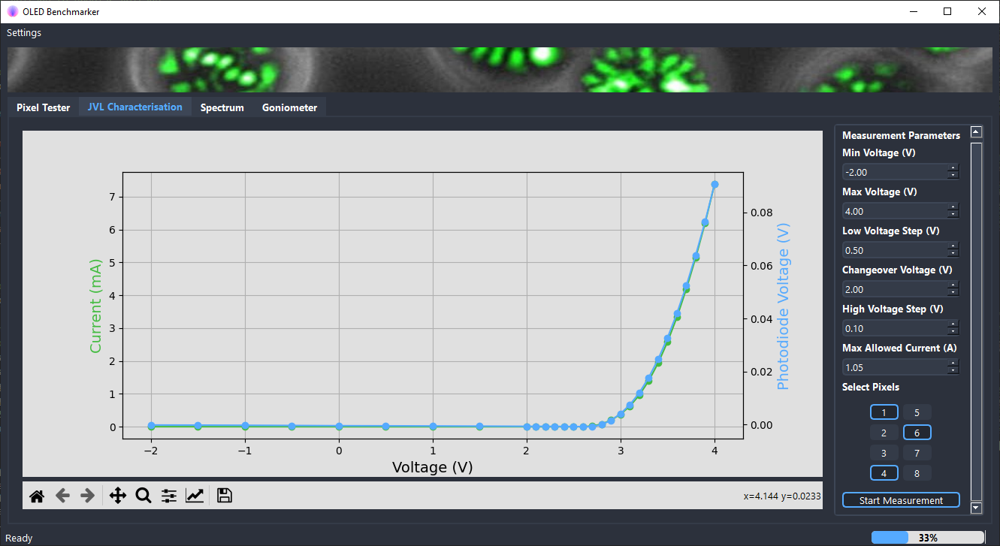
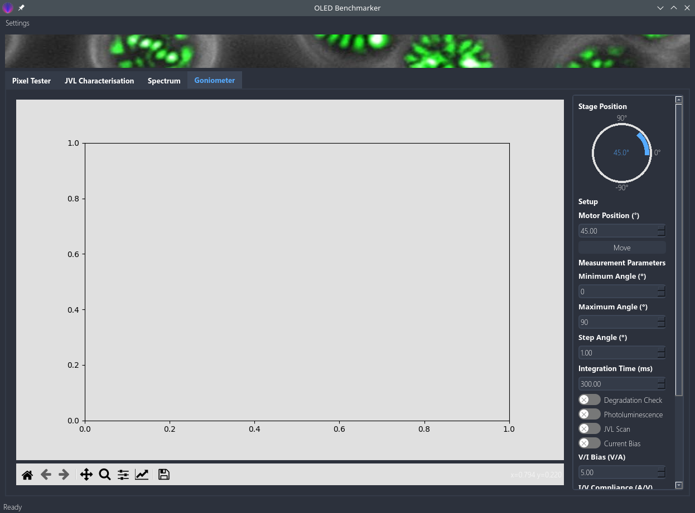
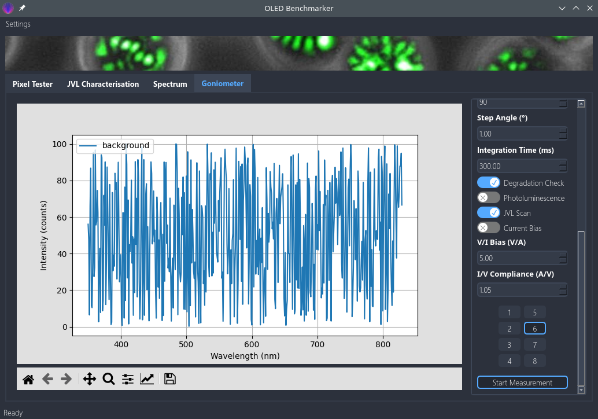
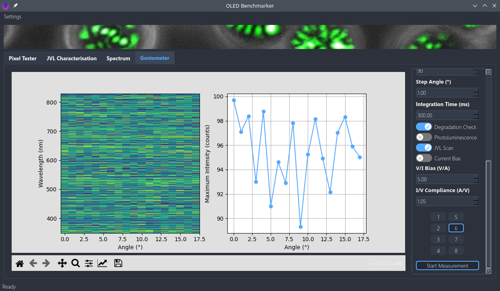
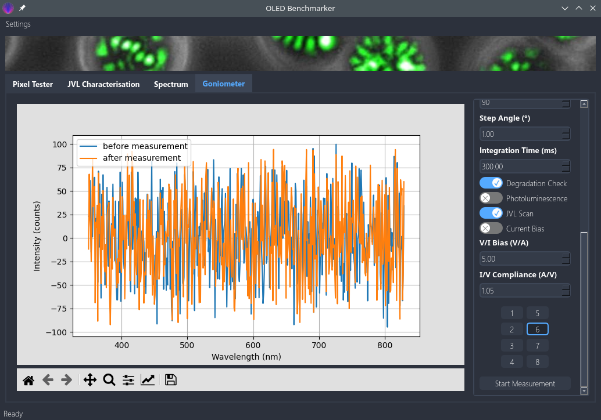
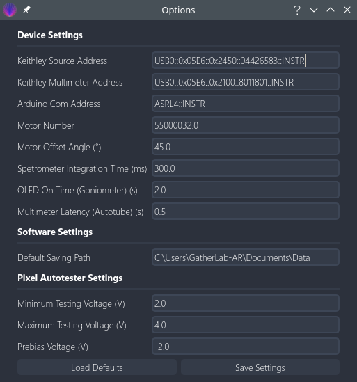

<h1 align="center">
  GatherLab OLED Measurement Setup
</h1>

<p align="center">
   <a href="https://github.com/GatherLab/OLED-jvl-measurement/commits/" title="Last Commit"></a>
   <a href="https://github.com/GatherLab/OLED-jvl-measurement/issues" title="Open Issues"></a>
   <a href="./LICENSE" title="License"></a>
</p>

<p align="center">
  <a href="#setup">Setup</a> •
  <a href="#hardware">Hardware</a>•
  <a href="#user\ journey">User Journey</a>
</p>

The goal of this project is to develop an easy to use interface for the investigation of organic leds (OLEDs). The measurements may or may not comprise current-voltage-luminance or spectral measurements. Additionally, an angle resolved spectrum of the OLED under investigation is made possible. Ultimately, the program should be easily usable and facilitate measurement and evaluation of classic OLED characterisation.

<!--  -->

## Setup

### First Setup

Setup a python environment with your favourite virtual environment management tool. The following step by step guide assumes that the user wants to use the since python 3.3 recommended software venv that ships with python on a windows machine.

1. Clone project folder to your local machine
2. Change e.g. with windows power shell into the project folder
3. Generate a virtual environement with the name "venv"

```terminal
py -m venv venv
```

4. Activate the new environement

```
Set-ExecutionPolicy Unrestricted -Scope Process
.\venv\Scripts\activate
```

5. Install required packages from requirements.txt (this assumes that pip is activated on your machine)

```
pip install -r requirements.txt
```

6. Install visual c++ build tools that are required for the python seabreeze environment: https://visualstudio.microsoft.com/visual-cpp-build-tools/
7. Install thorlabs_apt to obtain apt.dll driver (Follow https://github.com/qpit/thorlabs_apt for correct installation guidelines. For us, it only worked when apt.dll was copied to the Windows/System32 folder.
8. Ensure that libusb-1.0.lib driver is installed for detecting usb hardware (Follow https://stackoverflow.com/questions/33972145/pyusb-on-windows-8-1-no-backend-available-how-to-install-libusb for more on this)
9. Install NI-visa from website: https://www.ni.com/de-de/support/downloads/drivers/download.ni-visa.html#346210
10. Install Keithley drivers from website: https://de.tek.com/source-measure-units/2450-software-6 (prerequisit: NI-visa)
11. On the Keithley source meter (for specs see below) the command set on the Keithley has to be changed to SCPI
12. Execute the main.py file to start the program

13. Install Keysight I/O libraries https://www.keysight.com/de/de/lib/software-detail/computer-software/io-libraries-suite-downloads-2175637.html
14. Download and install USB Driver and PC software for GWInstek GPM-8213 (https://www.gwinstek.com/de-DE/Produkte/detail/GPM-8213).
15. On GPM-8213 via System, Config, switch to I/O Model USB to allow for USB connection. You should now be able to control the device via the PC software.

```terminal
python3 main.py
```

### Development

- Python formatter: black

## Hardware

The different OLED pixels are activated with and Arduino UNO and a relay shield. Power is provided by a Keithley source unit that also allows the simultaneous measurement of applied voltage and drawn current. Photodiode voltage is measured with a Keithley Multimeter. Spectra are measured with an Ocean Spectrometer. For the goniometer setup, the rotation of the sample is done with a Thorlab motor. All items needed for the setup are listed below.

| Item                | Brand         | Model Number                                       |
| ------------------- | ------------- | -------------------------------------------------- |
| Ocean Spectrometer  | Ocean Insight | QE Pro                                             |
| Arduino UNO         | Arduino       | Arduino UNO                                        |
| Keithley Source     | Keithley      | Sourcemeter, Keithley 2450                         |
| Keithley Multimeter | Keithley      | Multimeter, Keithley 2100                          |
| Photodiode          | Thorlabs      | Photodiode, ThorLabs Part PDA100A2                 |
| Thorlab Motor       | Thorlab       | Motorised Rotational Stage, ThorLabs Part K10CR1/M |

## User Journey

### Loading Window

To start the program execute main.py in your virtual environment setup as
described above. The start screen that appears should look something like
this. It will guide you through the initialisation of all different hardware
components.


In case everything went well and all hardware could be initialised the screen
will directly disappear. However, if the program had a problem initialising
any of the component it will indicate that in the following dialog. You can
either select to continue anyways if the device that could not be initialised
is not necessary for your measurements or you can troubleshoot your device
and retry the initialisation again. In case the device address is not
correct, either continue and modify it in the settings as described below or
directly modify it in the /usr/global_settings.json file.



In case everything went well or the user decided to continue anyways she will end up with the following window.



This main window gives you several options that can be selected from the top tabs and are

- Pixel Tester
- JVL Characterisation
- Spectrum
- Goniometer

Additionally, the user can select Settings from the top menubar. The
different tabs as well as the settings are described in more detail in the
following.

### Pixel Tester

In order to rapidly investigate which pixels are functioning, the user can
use the pixel tester (starting tab). For the testing the OLED device has to
be mounted in the OLED holder that must be connected to the Arduino
interface.

The **applied voltage** can be adjusted by changing the _Change Voltage (V)_
spin box at the bottom of the page. Press enter to make the changes to the
hardware and activate the output. However, as long as no pixel is selected,
all relays in the Arduino switch box are closed and therefore no voltage is
applied to the OLED pixels. **Select one or more pixels** by pressing on the
according number below _Select Pixel_ or on your keyboard.
**Select all or Unselect all pixels** by pressing the according button. As
soon as the button for the according pixel is pressed, the relay opens and,
if the pixel is working and the applied voltage is high enough, the OLED
lights up. You can either inspect this visually on the OLED or observe the
current drawn by the OLED on the LCD-type widget in the software. In case you
are measuring the OLED for the first time it makes sense to **pre-bias** all
pixels first. This can be done manually by adjusting the _Change Voltage (V)_
to a negative value (e.g. - 2 V) or by pressing the _Pre-bias_ button that
automatically activates all pixels one after the other and apply a
negative bias that can be adjusted in the settings (For more on this see the
settings section). The **Auto Test** button will try to automatically test all pixels by switching
them on one after the other and increasing the voltage slowly up to an
adjustable value (in the settings). It is necessary to set up the photodiode
already because part of the algorithm waits for a signal in the photodiode.

We have to see how reliable the automatic testing function works. For now it
is recommended to double check each pixel manually. After the auto test, all
working pixels are selected, while all non-working pixels are unselected.

### JVL Characterisation

Now that the user knows which pixels are working she can continue with the
measurements. To be able to do any measurement, the user has to **select a folder path**
and a **batch name** first. This can be done from the Pixel
tester widget as well. The user can browse for the folder path by clicking on
the _Browse_ button. The batch name should be something telling about the
entire batch (e.g. MADN-TBPe-TFE) so that the batch can be identified later
on again. I recommend using - instead of a space but it is not necessary for
later evaluation. It is important not to use _, however, since this will
interfere with later evaluation. Furthermore, the user can define a
**device number** that should be the number of the device for later identification.
The final filename will then be in the form
YYYY-MM-DD_batch-name_d<no>\_p<no>_<scan-no>.csv. Therefore, the program will
automatically name the file with the current date, the device number, the
pixel number and the scan number if several measurements were taken out. The
file type is a character separated file with tabs as separating character.



The user may now move on to the JVL characterisation tab. Central to it is a plotting area (based on matplotlib python library) that actively plots current and measured photodiode voltage for quick identification of good and bad pixels. The user has now the option to adjust several parameters

- Min Voltage (V): Minimum voltage where the sweep starts
- Max Voltage (V): Maximum voltage where the sweep ends
- Low Voltage Step (V): Voltage steps in the low voltage regime
- Changeover Voltage (V): Voltage that separated the low voltage and high voltage regime (so that different voltage steps can be done).
- High Voltage Step (V): Voltage step in high voltage regime
- Max Allowed Current (A): Maximum allowed current. If it is superseded, the Keithley source will change to constant current mode instead of constant voltage mode.

Furthermore, the user should select all pixels that she wants to measure (that are working) and subsequently start the measurement by pressing _Start Measurement_. The program will now go through all selected pixels and scan them with the above defined paramters. After the measurement of a pixel, its raw performance data will be plotted in the centre graph. Like this the user can obtain an idea of the device performance immediately. A progress bar on the bottom right of the screen indicates the progress of the measurement. If it reaches 100 % or disappeared, the measurement is done

### Spectrum


Switch to the spectrum tab to obtain a real time spectrum measured with the
spectrometer updated every second. The user can select a voltage and a pixel
(ideally the best working pixel from the previous scan) and can then press
_Save Spectrum_ to save the spectrum to file (the program also requires you
to select a valid folder before). The program will automatically measure a
spectrum with OLED on and one with it turned off and save both the background
and the spectrum to the same file.

### Goniometer



Finally, the user can also measure angle resolved EL and PL spectra using the
goniometer functionality of the software. Due to its complexity, this is the
part that is most prone to errors mainly due to hardware communication issues
(we are bound to the API provided with each hardware device). The user can
see the current motor position on the top right without the need to visually
check for the motor movement. This display should be quite reliable since it
updates by reading out the current motor position. Change the motor position
by adjusting the spin box _Motor Position (°)_ and pressing _Move_. Wait
until the motor reached its final position.

After mounting the sample the user can continue by adjusting the measurement parameters that comprise

- Minimum Angle (°): Minimum scanning angle, also the starting angle
- Maximum Angle (°): Maximum scanning angle
- Step Angle (°): angle step between minimum and maximum angle
- Integration Time (ms): Integration time of the spectrometer for each spectrum taken
- Degradation Check: If check, the program automatically rotates the stage back to 0° at the end of the measurement and plots the initially measured 0° measurement and the newly measured 0° measurement together to see how much the sample (the spectrum) changed (degraded) already.
- Photoluminescence: If checked, the software will disable all following options since they are only relevant for EL measurements. Furthermore, the program will assist the user by reminding on turning on and off the UV lamp during the measurement.
- JVL Scan: Additional JVL scan in the style of "JVL Characterisation" at 0° with the parameters inserted in "JVL Charcterisation"
- Current Bias: Choose to use a constant current instead of a voltage bias
- V/I Bias (V/A): Depending on the selection of current or voltage bias, the constant voltage or current that shall be applied to the device
- I/V Compliance (A/V): Depending on the selection of current or voltage bias, the maximum allowed current or voltage until the source switches to constant current or voltage mode.
- Pixel selection: The user must select exactly one pixel to be able to start the measurement (in the case of EL only).

After the above paramters are adjusted at will, the use can start the
measurement. The user will be guided through the measurement and can always
break the measurement by pressing the active _Start Measurement_ button
again.





### Settings


Additionally, to the above basic functionality, the user can change some more
"advanced" settings in the **Settings** dialog that can be reached from the
top menubar by selecting **Options**.

The other two possiblities are self-explanatory. The _Help_ button opens this
readme.md file on github and the _Open Log_ button opens the locally saved
log file.


The user has several additional options that are used less frequently that are:

- Keithley Source Address: Serial Interface address of the Keithley Source. Can be found from command line or in the device manual.
- Keithley Multimeter Address: Serial Interface address of the Keithley Multimeter. Can be found from command line or in the device manual.
- Arduino Com Address: Com Address of the arduino for serial communication. Can be found from Arduino IDE or command line.
- Motor Number: Thorlabs Motor number for serial communication. Can be found on the motor or in its manual.
- Motor Offset Angle (°): Offset angle to shift zero degrees angle (in case the motor is badly calibrated).
- Spectrometer Integration Time (ms): Integration time of the spectrometer in the "Spectrum" tab (the goniometer tab asks for it again)
- OLED On Time (Goniometer) (s): OLED on time during the EL goniometer scan before a spectrum is measured. This is needed since we observed the OLEDs to take a short time to return to an equilibrium state after switching on.
- Multimeter Latency (Autotube) (s): Multimeter latency before a measurement is taken out during autotube measurements. This is needed to obtain smooth data due to multimeter latency. A good experimentally obtained value seems to be 0.5 s
- Default Saving Path: Adjust the default saving path so that the user does not have to click her way through the entire hard drive to reach the folder were all his files are saved every time.
- Minimum Testing Voltage (V): Minimum testing voltage for the auto test functionality in the pixel tester
- Maximum Testing Voltage (V): Maximum testing voltage for the auto test functionality in the pixel tester
- Prebias Voltage (V): Voltage for automatic prebiasing in the pixel tester

The user has the option to load the default values and save her adjusted
settings. The saving will trigger a reinitialising of all hardware. This,
however, yields errors sometimes requiring a restart of the program. Settings
are saved to /usr/global_settings.json the user can also directly modify
settings here. I recommend not to change the default settings (or only if the
default changes).

### Data Format

There are three automatically generated types of files depending on the measurement taken out by the user, they differ in their filename ending:

- JVL Characterisation: "2021-04-06_test_d12_p1_jvl.csv"
- Spectrometer: "2021-04-06_test_d12_p1_spec.csv"
- Goniometer: "2021-04-06_test_d12_p6_gon-spec.csv" & "2021-04-06_test_d12_p6_gon-jvl.csv"

this is relevant for later data evaluation and therefore shouldn't be changed.
